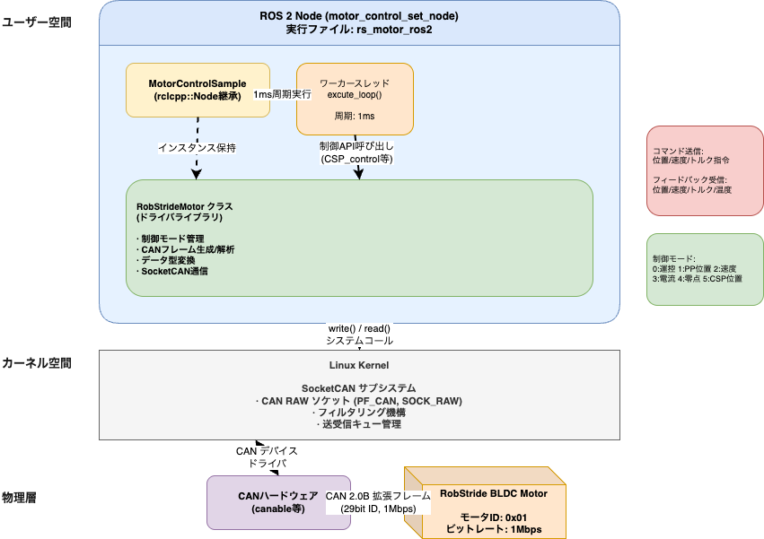
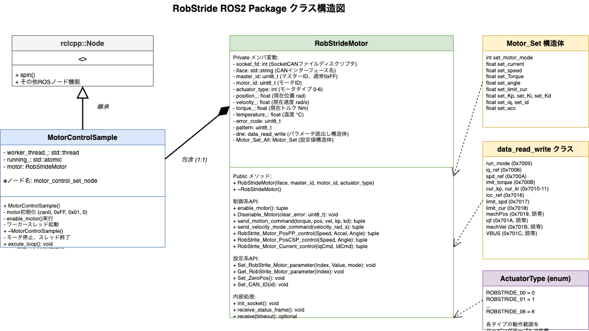
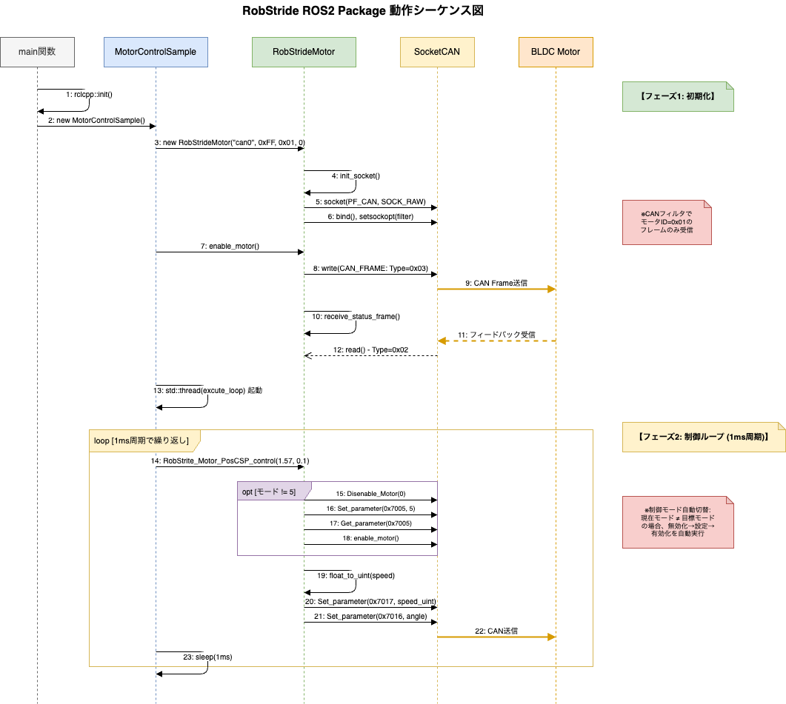
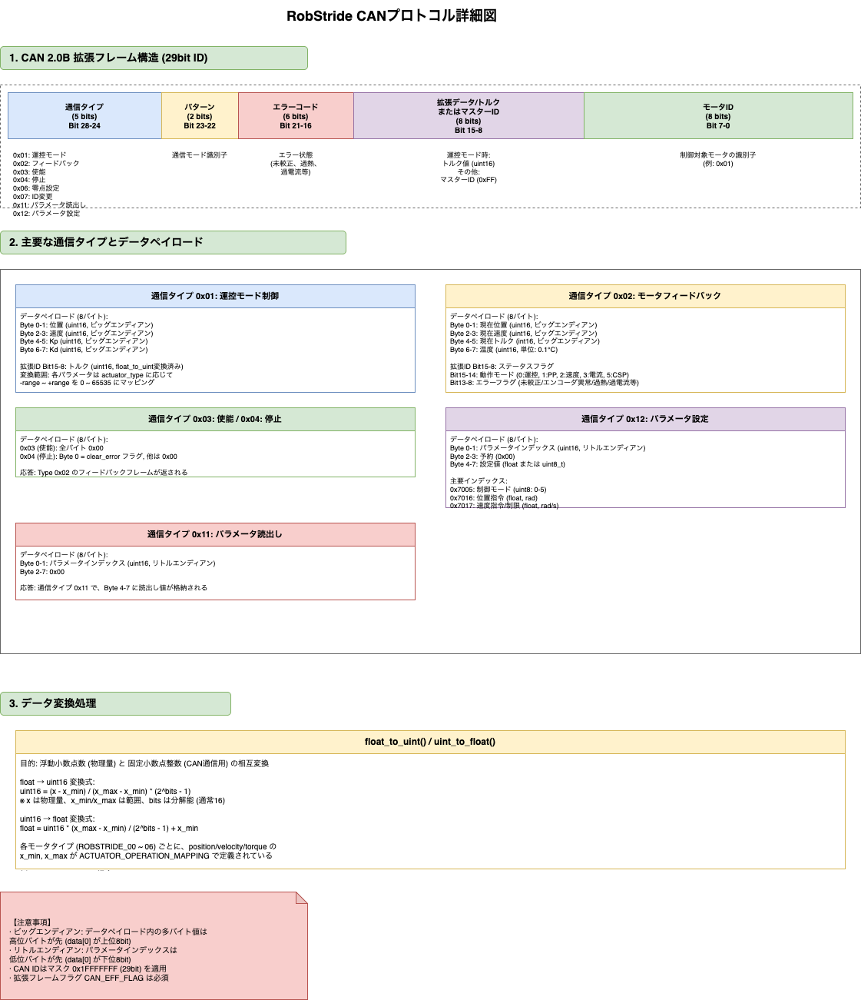
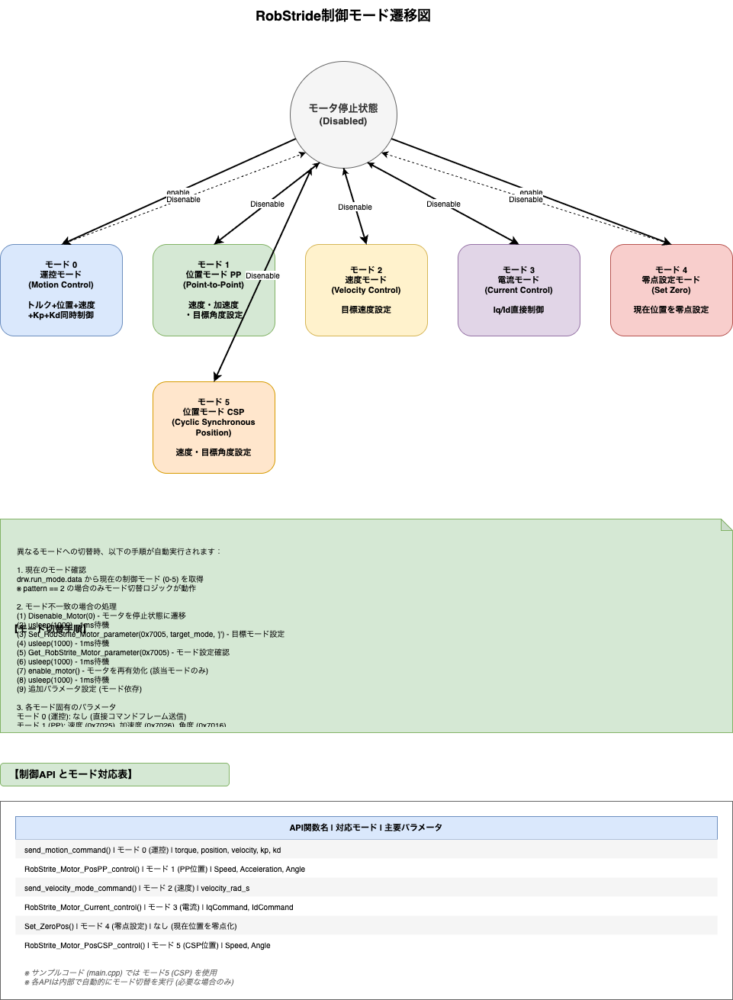

# RobStride ROS 2 Package Architecture

このドキュメントでは、`rs_motor_ros2` パッケージのシステムアーキテクチャ、提供ノード、および入出力について解説します。

## 1. 概要
このパッケージは、RobStride製のBLDCモータをROS 2環境で制御するためのライブラリおよびサンプルノードを提供します。LinuxのSocketCANインターフェースを介してモータと通信を行い、以下の制御モードを利用可能とする低レベルAPIを `RobStrideMotor` クラスとして提供します：

- **運控モード（Mode 0）**: トルク、位置、速度、Kp、Kdを同時に指定する制御モード
- **位置モード PP（Mode 1）**: Point-to-Point位置制御モード
- **速度モード（Mode 2）**: 速度制御モード
- **電流モード（Mode 3）**: Iq/Id電流直接制御モード
- **零点モード（Mode 4）**: 機械的零点設定モード
- **位置モード CSP（Mode 5）**: Cyclic Synchronous Position制御モード

## 2. 提供ノード

本パッケージは以下のサンプルノードを提供しています。

*   **ノード名**: `motor_control_set_node`
*   **実行ファイル名**: `rs_motor_ros2`
*   **ソースファイル**: `src/main.cpp`
*   **機能**:
    *   起動時に `RobStrideMotor` クラスを初期化し、CANインターフェース（デフォルト `can0`）、マスターID（`0xFF`）、モータID（`0x01`）、アクチュエータタイプ（`0`）を設定します。
    *   モータをイネーブル（有効化）状態にします。
    *   専用のワーカースレッド（`excute_loop`）を立ち上げ、一定周期（1ms）で制御ループを実行します。
    *   サンプル実装では、**CSP（Cyclic Synchronous Position）モード** を用いた位置制御API（`RobStrite_Motor_PosCSP_control(float Speed, float Angle)`）を呼び出します。現在のコードでは `position` (1.57f) を第1引数（Speed）、`velocity` (0.1f) を第2引数（Angle）として渡していますが、これは実装上の変数名とパラメータ名の不一致によるものです。
    *   制御ループ内でモータからのフィードバック（位置、速度、トルク、温度）を取得しますが、現在のサンプルではこれらの値を外部に公開していません。

## 3. 入出力 (Inputs and Outputs)

現在のサンプル実装（`src/main.cpp`）およびライブラリコードにおける入出力定義は以下の通りです。

### 3.1 ROS 2 インターフェース
現在のサンプルコードは、ROS 2の通信機能（Topic, Service）を外部に公開していません。ノード内部で生成された固定の目標値に基づいて動作します。
*   **Subscribers**: なし
*   **Publishers**: なし
*   **Services**: なし

*※ 実際のアプリケーション開発では、このノードを拡張して `sensor_msgs/JointState` のPublishや、制御コマンドトピックのSubscribeを実装することが想定されます。*

### 3.2 ハードウェアインターフェース (CAN)
*   **インターフェース**: SocketCAN (`can0`)
*   **ビットレート**: 1 Mbps（1000000 bps）
*   **フレーム形式**: CAN 2.0B拡張フレーム（29ビットID）
*   **プロトコル**: RobStride カスタムプロトコル

#### CANフレーム構造
29ビット拡張IDは以下のように分割されています：
```
Bit 28-24: 通信タイプ (Communication Type)
Bit 23-22: パターン情報
Bit 21-16: エラーコード
Bit 15-8:  拡張データ（通信タイプ依存）またはマスターID
Bit 7-0:   モータID
```

#### 出力 (TX) - 主要なコマンド
| 通信タイプ | 名称 | 説明 | 主要API |
|----------|------|------|--------|
| 0x01 | 運控モード制御 | トルク、位置、速度、Kp、Kdを同時指定 | `send_motion_command()` |
| 0x03 | モータ使能 | モータを有効化 | `enable_motor()` |
| 0x04 | モータ停止 | モータを無効化 | `Disenable_Motor()` |
| 0x06 | 零点設定 | 現在位置を零点として設定 | `Set_ZeroPos()` |
| 0x07 | CAN ID変更 | モータのCAN IDを変更 | `Set_CAN_ID()` |
| 0x11 | 単一パラメータ読出し | 指定インデックスのパラメータを読出し | `Get_RobStrite_Motor_parameter()` |
| 0x12 | 単一パラメータ設定 | 制御モード切替やパラメータ設定 | `Set_RobStrite_Motor_parameter()` |

#### 入力 (RX) - フィードバック
| 通信タイプ | 名称 | データ内容 |
|----------|------|-----------|
| 0x02 | モータ状態フィードバック | 位置(rad)、速度(rad/s)、トルク(Nm)、温度(0.1℃単位) |
| 0x11 | パラメータ読出し応答 | 要求されたパラメータの現在値 |

#### データエンコーディング
- **位置**: 16ビット符号付き、範囲 -4π ~ +4π rad（モータタイプにより変動）
- **速度**: 16ビット符号付き、範囲はモータタイプ依存（例：±50 rad/s）
- **トルク**: 16ビット符号付き、範囲はモータタイプ依存（例：±17 Nm）
- **温度**: 16ビット符号なし、0.1℃単位
- エンコーディングは`float_to_uint()`および`uint_to_float()`関数で実装

## 4. システムアーキテクチャ

本パッケージの内部構造は、ROS 2ノード層と、ハードウェア通信を担うドライバ層（`RobStrideMotor` クラス）に大きく分かれています。

### 4.1 クラス構成

#### 4.1.1 `MotorControlSample` (src/main.cpp)
*   `rclcpp::Node` を継承したROS 2ノードクラスです。
*   ノード名: `motor_control_set_node`
*   **主要メンバ変数**:
    - `motor`: `RobStrideMotor`インスタンス（CAN通信と制御を担当）
    - `worker_thread_`: 制御ループを実行する専用スレッド
    - `running_`: スレッド制御用のアトミックフラグ
*   **主要メソッド**:
    - コンストラクタ: モータの初期化、有効化、ワーカースレッド起動
    - デストラクタ: モータの無効化、スレッド終了
    - `excute_loop()`: 1msごとに制御コマンドを送信するワーカースレッド関数

#### 4.1.2 `RobStrideMotor` (include/motor_ros2/motor_cfg.h, src/motor_cfg.cpp)
モータ制御のコアロジックを実装したクラスです。

*   **主要メンバ変数**:
    - `iface`: CANインターフェース名（例: "can0"）
    - `master_id`: マスターデバイスID（通常 0xFF）
    - `motor_id`: 制御対象モータのID
    - `socket_fd`: SocketCANのファイルディスクリプタ
    - `actuator_type`: アクチュエータタイプ（0〜6、特性マッピングに使用）
    - `position_`, `velocity_`, `torque_`, `temperature_`: 最新のフィードバック値
    - `drw`: パラメータ読出し構造体（`data_read_write`）
    - `Motor_Set_All`: 設定値保持構造体（`Motor_Set`）

*   **主要メソッド**:

| メソッド | 機能 |
|---------|------|
| `init_socket()` | SocketCANの初期化、フィルタ設定 |
| `enable_motor()` | モータ使能コマンド送信（通信タイプ 0x03） |
| `Disenable_Motor()` | モータ停止コマンド送信（通信タイプ 0x04） |
| `send_motion_command()` | 運控モード制御（通信タイプ 0x01） |
| `send_velocity_mode_command()` | 速度モード制御（モード 2） |
| `RobStrite_Motor_PosPP_control()` | PP位置モード制御（モード 1） |
| `RobStrite_Motor_PosCSP_control()` | CSP位置モード制御（モード 5） |
| `RobStrite_Motor_Current_control()` | 電流モード制御（モード 3） |
| `Set_RobStrite_Motor_parameter()` | パラメータ設定（通信タイプ 0x12） |
| `Get_RobStrite_Motor_parameter()` | パラメータ読出し（通信タイプ 0x11） |
| `Set_ZeroPos()` | 零点設定（通信タイプ 0x06） |
| `Set_CAN_ID()` | CAN ID変更（通信タイプ 0x07） |
| `receive_status_frame()` | CANフレーム受信と解析 |
| `float_to_uint()` / `uint_to_float()` | データ型変換 |

### 4.2 制御モード自動切替機構

`RobStrideMotor` クラスの一部の制御メソッドは、呼び出し時に `drw.run_mode.data` および `pattern` を参照し、必要に応じて自動的にモード切替を行います：

1. 現在のモードを `drw.run_mode.data` から取得
2. 目標モードと異なる場合（かつ条件を満たす場合）：
   - モータを無効化（`Disenable_Motor()`）
   - モード設定パラメータを送信（`Set_RobStrite_Motor_parameter(0x7005, ...)`）
   - モード読出しで確認（`Get_RobStrite_Motor_parameter(0x7005)`）
   - モータを再有効化（`enable_motor()`）
   - 必要に応じて追加パラメータ設定
3. 制御コマンドを送信

**注意**: すべてのメソッドで完全自動切替が行われるわけではありません。例えば：
- `send_motion_command`, `send_velocity_mode_command`, `RobStrite_Motor_PosCSP_control`, `RobStrite_Motor_PosPP_control` は `pattern == 2` の条件付きでモード切替を実施
- `RobStrite_Motor_Current_control` は `pattern` をチェックせずにモード切替を実施
- モード切替条件はメソッドごとに異なるため、使用時は各メソッドの実装を確認することを推奨します。

### 4.3 データフロー

```
[ユーザーアプリケーション]
         ↓
    [MotorControlSample Node]
    - excute_loop() (1ms周期)
         ↓
    [RobStrideMotor クラス]
    - 制御コマンド生成
    - CANフレーム構築
         ↓
    [SocketCAN API]
    - write(socket_fd, ...)
         ↓
    [Linuxカーネル CAN Stack]
         ↓
    [CANハードウェア (canable等)]
         ↓
    [RobStride BLDC Motor]
         ↓ (フィードバック)
    [RobStrideMotor::receive_status_frame()]
    - フレーム解析
    - position_, velocity_, torque_, temperature_ 更新
```

### 4.4 アクチュエータタイプマッピング

`ACTUATOR_OPERATION_MAPPING` により、モータタイプ（0〜6）ごとの動作範囲が定義されています：

- **position**: 位置範囲（通常 ±4π rad）
- **velocity**: 速度範囲（例：15〜50 rad/s、タイプ依存）
- **torque**: トルク範囲（例：17〜120 Nm、タイプ依存）
- **kp**, **kd**: 制御ゲイン範囲

これらのパラメータは、`float_to_uint()` によるデータエンコーディング時のスケーリング係数として使用されます。

## 5. アーキテクチャ図 (draw.io)

本システムの構成および動作フローを示す図面は、`docs/` ディレクトリ配下に draw.io 形式（XML）で保存されています。[draw.io (diagrams.net)](https://app.diagrams.net/) でこれらのファイルを開くことで、図の閲覧・編集が可能です。

### 5.1 全体アーキテクチャ図
*   **ファイル**: [architecture_overview.drawio.png](./architecture_overview.drawio.png)
*   **内容**: ROS 2ノード層、ドライバライブラリ層、OSカーネル (SocketCAN)、およびCANハードウェア・物理モータの階層関係とデータフローを示します。システム全体の概観を把握するための図です。

[](./architecture_overview.drawio.png)

### 5.2 クラス構造図
*   **ファイル**: [class_diagram.drawio.png](./class_diagram.drawio.png)
*   **内容**: `MotorControlSample` クラスと `RobStrideMotor` クラスの内部構造を示します。主要なメンバ変数、メソッド、および継承・コンポジション関係を記述しています。

[](./class_diagram.drawio.png)

### 5.3 動作シーケンス図
*   **ファイル**: [sequence_diagram.drawio.png](./sequence_diagram.drawio.png)
*   **内容**: ノードの初期化からモータ制御までの時系列動作を示します。SocketCANのセットアップ、モータのイネーブル処理、制御ループでのコマンド送信とフィードバック受信の流れを記述しています。

[](./sequence_diagram.drawio.png)

### 5.4 CANプロトコル詳細図
*   **ファイル**: [can_protocol_detail.drawio.png](./can_protocol_detail.drawio.png)
*   **内容**: CANフレーム構造の詳細、29ビット拡張IDのビットフィールド定義、主要な通信タイプごとのデータペイロード構造を示します。

[](./can_protocol_detail.drawio.png)

### 5.5 制御モード遷移図
*   **ファイル**: [control_mode_transition.drawio.png](./control_mode_transition.drawio.png)
*   **内容**: 6種類の制御モード（運控、PP、速度、電流、零点、CSP）間の遷移ロジック、各モードで使用可能なパラメータ、モード切替時の処理フローを示します。

[](./control_mode_transition.drawio.png)

